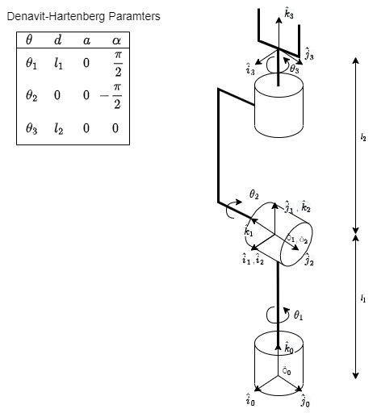
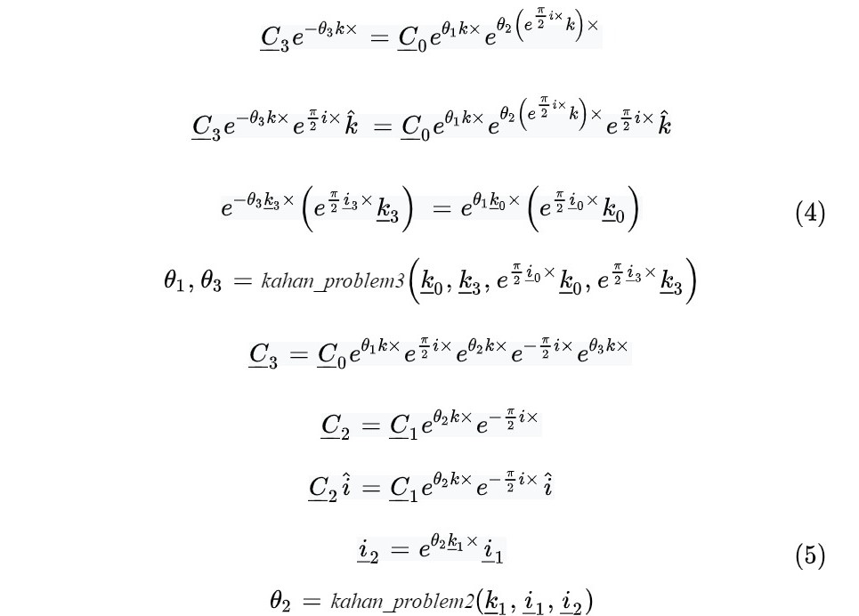
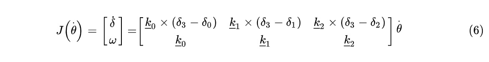

# robot-controller

ELEC/CPEN 491 Team JY-062 Project Repository

This project contains the control system simulations and source code for a 3 degree of freedom (DOF) manipulator, tweezer end-effector and human interface controller requested by UBC Studios to handle small specimens used in the photogrammetry process.

1. [Requirements](#Requirements)
2. [Analysis](#Analysis)
    - [Direct Kinematics](#Direct-Kinematics)
    - [Inverse Kinematics](#Inverse-Kinematics)
    - [Jacobian Matrix](#Jacobian-Matrix)

## Requirements 

The manipulator control system is written using a combination of C/C++, a FreeRTOS port and some matrix libraries. To run the robot's firmware, you will need to install the following software in order to build the code and program the microcontroller (currently a Teensy 4.0).

- [Visual Studio Code](https://code.visualstudio.com/download)
- [PlatformIO IDE](https://platformio.org/install/ide?install=vscode)
- [FreeRTOS-Teensy4](https://platformio.org/lib/show/6737/FreeRTOS-Teensy4/installation)
    - Should be able to install this through PlatformIO library manager
- [ArduinoEigen](https://github.com/hideakitai/ArduinoEigen)
    - Should be able to install this through PlatformIO library manager

## Analysis 

The manipulator control system was developed using transformations derived from the [Denavit-Hartenberg (DH) convention](https://en.wikipedia.org/wiki/Denavit%E2%80%93Hartenberg_parameters). Using this system, and the [Paden–Kahan Subproblems](https://en.wikipedia.org/wiki/Paden%E2%80%93Kahan_subproblems), we were able to perform the inverse and direct kinematic analysis, as well as the inverse and direct dynamics analysis. The DH parameter equations relating the coordinate frame and origin of consecutive joints is shown in equation (1) and (2).

  

  

### Direct Kinematics 

To relate the end-effector coordinate frame and origin to the three joint variables, we used the DH parameters, $\theta$, $d$, $a$, $\alpha$ to model each joint's frame and origin as a function of the previous joint, and finally for the end-effector as a function of the three joints. Equation (3) shows the relationship between the end-effector frame and the three joint variables, because the manipulator only needs to control orientation, we will not be considering the end-effector origin in our control system.

  

### Inverse Kinematics 

The inverse kinematics of the manipulator were considerably more complicated as the configuration gives several possible solutions to achieve a given orientation. Following the derivation below, we start with the direct kinematics equation and modify the expression to relate $\underline{C}_2$ to $\underline{C}_1$ and remove the dependency on $\theta_2$ by multiplying both sides by a vector in the direction of the axis rotated by $\theta_2$. Finally we multiply both sides of the expression by their associated frames ($\underline{C}_3,  \underline{C}_0$) to reveal a Kahan Problem 3 expression which can be used to solve for $\theta_1, \theta_3$ (4).
 
With $\theta_1$ and $\theta_3$ known, we can use them in the original direct kinematics equation to find an expression dependent only on $\theta_2$, this is shown as a Kahan Problem 2 (5).

  

### Jacobian Matrix 

The Jacobian matrix is also being used to relate the joint velocities, $\dot{\theta}_1, \dot{\theta}_2, \dot{\theta}_3$, to the end effector velocity $[\dot{\delta}$ $\omega]'$, the general expression for three revolute joints in series is shown in (6).

  

